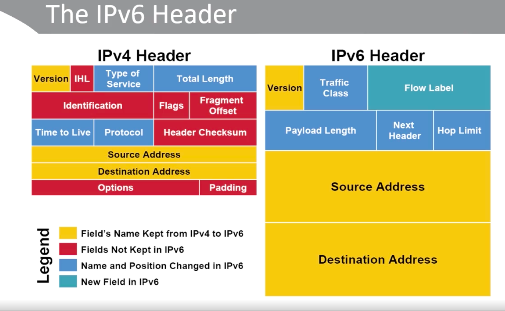
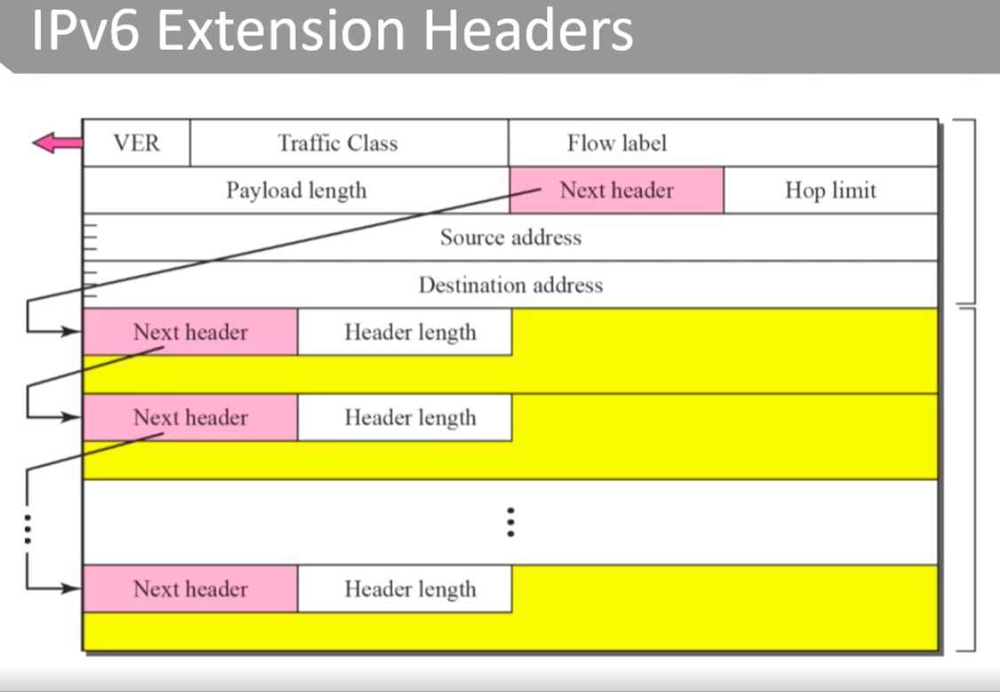
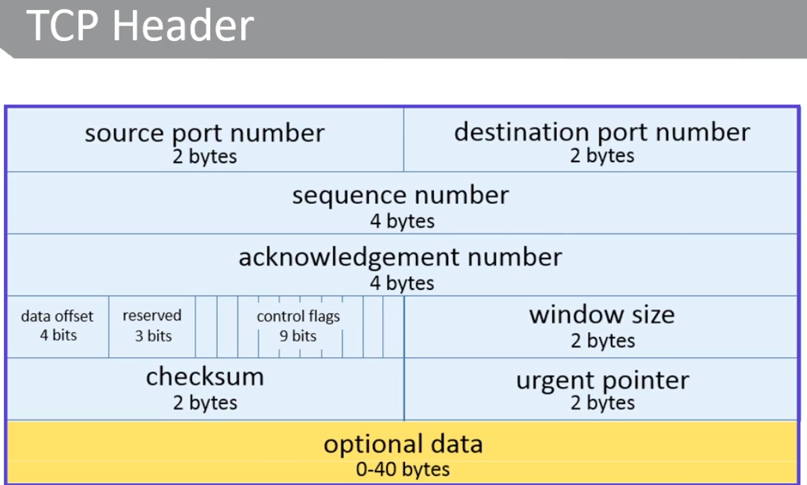
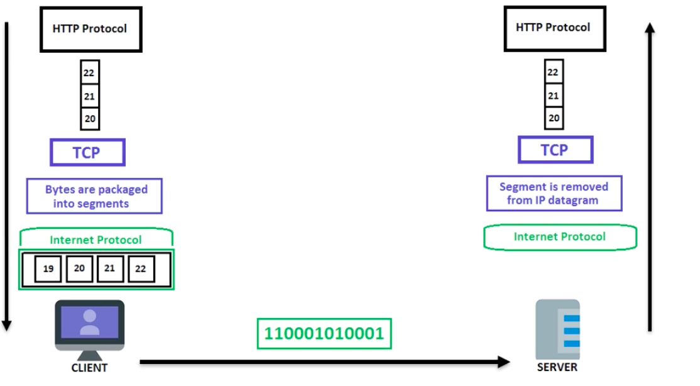
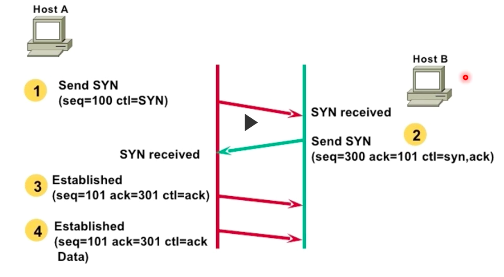

# TCP/IP Essentials

## Review of the OSI, TCP/IP Model

This is a high overview of the OSI, TCP-IP model. The descriptions can be considerd very high-level, as in hardly scratching the surface as each layer has a plethora of functionalities and capabilities.

| Number | Name | Description |
|:------:|:----:|:-----------:|
|7|Application|To accomplish a network user task|
|6|Presentation|Expressing and translating data formats|
|5|Session|To accommodate multiple session connections|
|4|Transport|Connecting multiple programs on the same system|
|3|Network|Facilitate multihop communications across potentially different link networks|
|2|Link|Communication across a single link including media access control|
|1|Physical|Specifies connectors, data rates, and encoding bits|

## IPv4/IPv6/ICMP/ICMPv6

### IPv4 v. IPv6

| v4 | v6 |
|:-:|:-:|
|2^32 address space|2^128 address space|
|Dotted decimal format|Hexadecimal notation|
|DHCP dynamic addressing|SLAAC DHCPv6|
|Header has 20 bytes and 13 fields|Header has 40 bytes and 8 fields|
|variable header length|fixed header length|
|header options (obsolete)|header extensions|
|header checksum|no header checksum|

###  More v4 - v6

| Version 4 | Version 6 |
|:-:|:-:|
| Packet size: 576 bytes required, fragmentation optional|Packet size: 1280 bytes required without fragmentation|
|Packet fragmentation: Routers and sending hosts|Packet fragmentation: Sending hosts only|
|IPv4 was never designed to be secure|Have native encryption and authentication|
|IPsec optional|IPsec mandatory|
|Non-equal geographical distribution (>50% USA)|No geographical limitations|

## Packet Header

## Assigning IPv6 Addresses

There are three methods for assigning IPv6 addresses:

* manual
* stateful autoconfiguration (using DHCPv6 server)
* stateless autoconfiguration (SLAAC)

### stateless autoconfiguration (SLAAC)

### IPv6 Extension Headers

* IPv6 uses distinct types of headers: The regular IPv6 Header and IPv6 Extension Headers
* The extension headers, if there are any, follow the original 8 fiels
* The number of extension headers is not fixed, so the total length of the extension header chain is variable

### Uses for EH

* Hop-by-hop EH is used to support Jumbo-grams
* destination EH is used in IPv6 mobility
* routing EH is used in IPv6 mobility and source routin
* fragmentation EH is critical
* mobility EH is used in support of Mobile IPv6 service
* authenticaion EH and encapsulating securty payload EH

## ICMP - Internet Control Message Protocol

* since IP in unreliable and doesn't guarantee delivery, ICMP is used as feedback mechanism offering feedback about network problems
* IP doesn't offer a direct method for collecting diagnostic information
* it resides between the _Transport_ and _Network_ layers
* ICMP provides error messages and informational messages

### ICMPv6

The nature of ICMPv6 can provide some security issues'

* most routers and firewall block most settings or ICMP by default
* if blocked, diagnostic tools like ping and traceroute will not work
* there's a number of Tpyee

## Common ICMPv4 Messages

|Name|Type|E/I |Desciption|
|:----:|:----:|:---------:|:-----:|
| Echo Reply|0|I|Ping reply that reutrns data|
|Destination Unreachable|3|E|Unreachable host/protocol|
|Redirect|5|E|Alternate gateway should be used|
|Echo|8|L|Ping request(data option)|
|Time Exceeded|11|E|Resource Exhausted|
|Parameter Problem|12|E|Malformed packet or header|

### IPv6 Neighbor Discovery

* The ICMPv6 provides the same diagnostic services as ICMPv4
    + Error and informational messages
* It extends the functionality for some specific IPv6 functions that did not exist in IPv4:
    + router solicitation and advertisement
    + neighbor solicitation and advertisement
    + redirection of nodes to the best gateway (router)

## Layer 4 Protocols

We're going to dive right into the Layer 4 protocols __UDP__ and __TCP__. They are both full-fleged protocols that contain many functionalities an use-cases The goal in this exam will be to have a thorough understanding of __tcpdump__.
A simple, yet extremely powerful network command for any Engineer to learn.

## TCP

First, here's what a TCP header is made up of:

### Quick TCP facts:

* Addressing and multiplexing
* Connection handling
* packaging and managing data
* transfers data
* provides reliability and transmission quality
    + flow-control
    + windowing
* congestion avoidance

####  What TCP is not good for:

* does not determine how apps actually use the protocol
* no privacy or authenticity
* continuous stream of segments instead of descrete messages
* TCP will not guarantee delivery of segments
    + it can only detect failed transport and resend

### TCP Operations

* TCP takes bytes from upper layers and sends it to L3
* bytes are divided into segments
    + a discrete piece of a stream
* IP places the minto datagrams and passes the encapsulated packet to the link layer to be 'framed' with a header and trailer

* tracks each byte of data with a sequence number applied to blocks
* sequence numbers are used to make sure segmented data can be reassembled and transmitted if possible
* TCP uses a sliding window acknowledgement system

### Continued Operations

* each node's TCP stack uses retransmission queue
* each sent segment is placed in the queue and a restransmission timer is started
* when ACk is received, the data is removd from the queue
* if the timer expires, the segment is retransmitted

### TCP Flags - or Control Bits

|Subfield Name  | Description |
|:-------------:|:-----------:|
| URG | Indicates priority data transfer feature for this segment | 
| ACK | Indicates that segment is carrying acknowledgement |
| PSH | Push feature requests that data be pushed to receiving application immediately |
| RST | Sender has encountered problem and needs to reset the connection |
| SYN | A request to synchronize sequence numbers to establish a connection |
| FIN | The sender is requesting to terminate the connection |

__Note__: Each flag's subfield is 1 bit in size

### Comparing UDP to TCP

* UDP does not ensure data delivery
* if TCP is used, layer-4 has those additional responsibilities
* UDP does not provide segmentation services
* behavior is best-effort connectionlees
* no sequencing of segments
* perferred for video, streaming, confrencing, DNS queries, and TFTP

* in real-time apps, dropped packets can be accepted as long as the overall percentage of dropped packets is relatively low
* connectionless protcol is appropriate for programs that need faster communication without verifying that it's been recieved

_Analogy_: TCP is sending Certified Mail, whereas UDP is an Ad flyer

### Uses of UDP

* when you need rapid responses (like a DNS query)
* preferably the response comes back in a single packet
* Connection costs are too high for TCP
* when you can afford to lose some data (i.e.: stock ticker, audio, video, gaming data)
* UDP can be multicasted to more than on host

### Commong UDP Services

* DNS queries
* SNMP
* Routing Info Protocol (RIP)
* DHCP
* Datagaram TLS (DTLS)
* Real-time audio and video streaming protocols