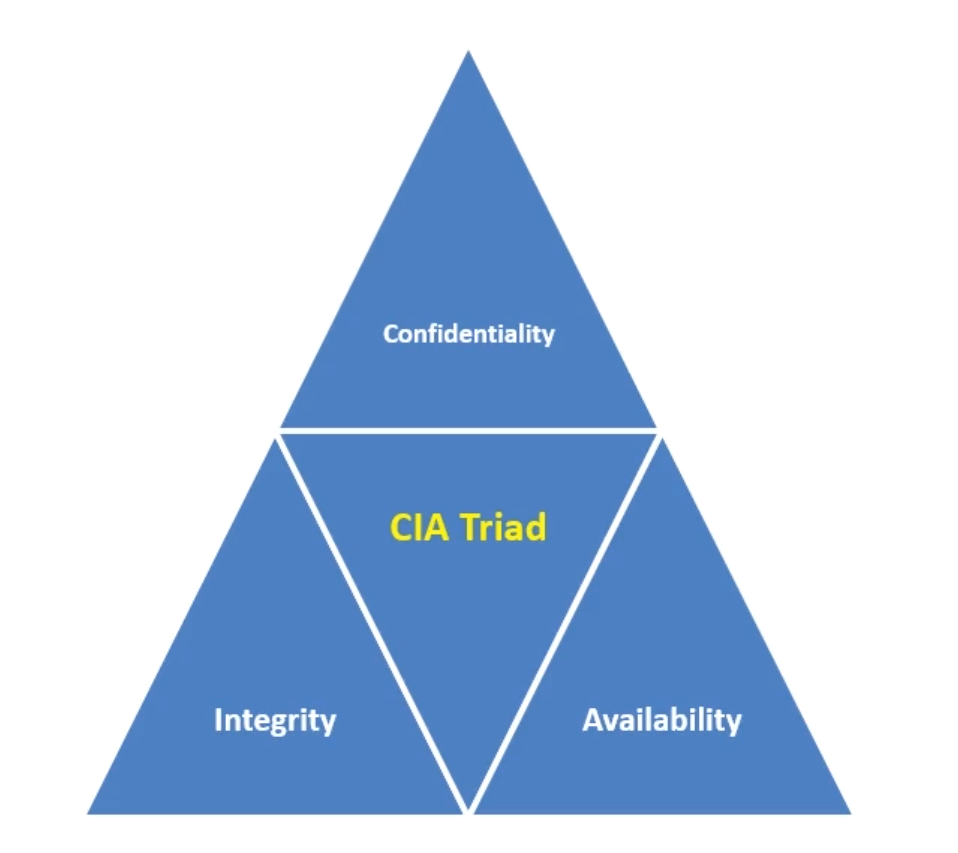
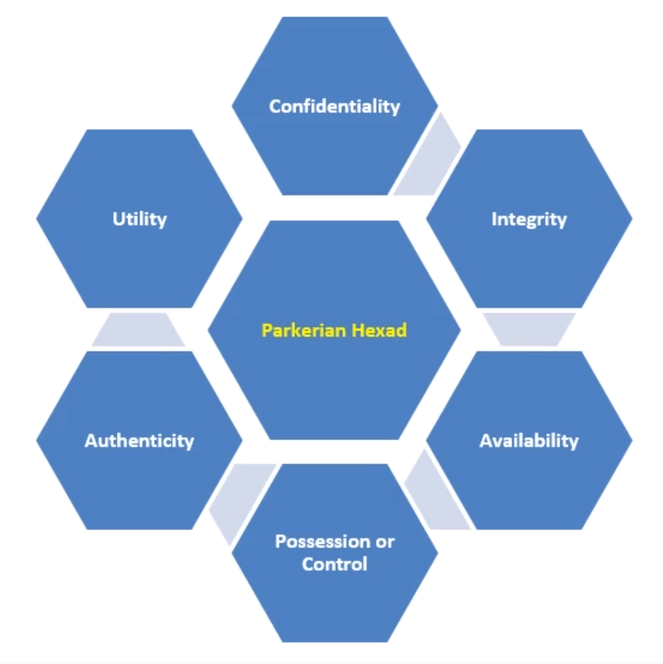

# CIA Triad and Parkerian Hexad

## Confidentiality

* Confidentiality is the act of preserving authorized restrictions on information access and disclosure, including means for protecting personal privacy and proprietary information using:
    + cryptosystems
    + compartmentalization
    + encapsulation

## Integrity

* Integrity involves guarding against improper information modification or destruction and ensuring information non-repudation and authenticity using:
    + cryptographic hashing
    + digital signatures

## Availability

* Availability - ensuring timely and reliable access to and use of information using
    + backups and snapshots
    + redundancy and failover
    + availability zones
    + business continuity planning

### CIA Triad Depiction 

### Parkerian Hexad Depiction

