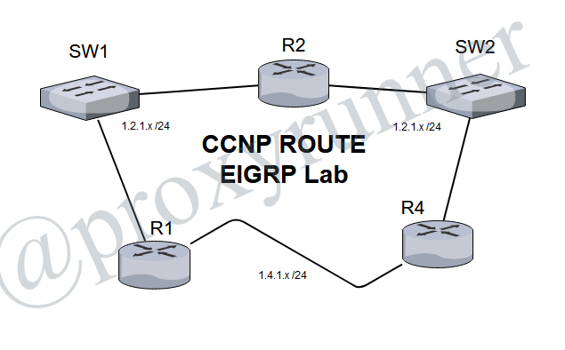

# CCNP Route - EIGRP Lab



## EIGRP Lab-1: Initial Configuration

Theory will be discussed of the workflows in this workbook. We have a literal [configuration file](./EIGRP.conf) in this directory that could be referenced.

### Verification

```
show ip eigrp neighbor
show ip eigrp topology
show ip route eigrp
```

## EIGRP Lab-2: EIGRP Neighborships

When EIGRP neighbors are configured, they must be in the same Autonomous System. This lab reviews the syslogs and debugs for errors that arise when the EIGRP AS numbers are mismatched.

When EIGRP neighbors are mismatched, there is no indication of the problem in any syslogs, and debugs will not display any errors either.

### Task 1

After reviewing mismatched EIGRP instances, reconfigure the Routers and restore services. Next, configure  Router 2's __1.2.1.x__ interface with primary and seconday IP addresses as [needed](./EIGRP.CONF).

The interface configuration will have the console output saying this every couple of moments:

```
*Nov  1 01:50:09.047: %DUAL-5-NBRCHANGE: EIGRP-IPv4 100: Neighbor 2.4.2.4 (FastEthernet1/0) is up: new adjacency
```

On Router-2, it is receiving EIGRP Hello packets sourced from the primary IP address on Router-1 (1.2.1.1). Router-2 does have this subnet configure, but its interface is a __secondary__ subnet. So it attempts to send an EIGRP _Update packet_ to Router-1.

Router-1 is blocking Router-2 because the source IP address of Router-2's EIGRP Hello's (2.2.2.2) is not from a subnet that Router-1 recognizes. When Router-1 is receiving the EIGRP _Update_ from Router-2, it discards it.

Since EIGRP is reliable, Router-2 will attempt to resent the EIGRP _Update Packets_ to Router-1 several times before giving up.

Next - we'll take a look at the output of a *__show ip protocols__*:

```
L2R2#sho ip protocols
*** IP Routing is NSF aware ***

Routing Protocol is "eigrp 200"
  Outgoing update filter list for all interfaces is not set
  Incoming update filter list for all interfaces is not set
  Default networks flagged in outgoing updates
  Default networks accepted from incoming updates
  EIGRP-IPv4 Protocol for AS(200)
    Metric weight K1=1, K2=0, K3=1, K4=0, K5=0
    NSF-aware route hold timer is 240
    Router-ID: 2.4.2.2
    Topology : 0 (base) 
      Active Timer: 3 min
      Distance: internal 90 external 170
      Maximum path: 4
      Maximum hopcount 100
      Maximum metric variance 1

  Automatic Summarization: disabled
  Maximum path: 4
  Routing for Networks:
  Routing Information Sources:
    Gateway         Distance      Last Update
  Distance: internal 90 external 170

Routing Protocol is "eigrp 100"
  Outgoing update filter list for all interfaces is not set
  Incoming update filter list for all interfaces is not set
  Default networks flagged in outgoing updates
  Default networks accepted from incoming updates
  EIGRP-IPv4 Protocol for AS(100)
    Metric weight K1=1, K2=0, K3=1, K4=0, K5=0
    NSF-aware route hold timer is 240
    Router-ID: 2.4.2.2
    Topology : 0 (base) 
      Active Timer: 3 min
      Distance: internal 90 external 170
      Maximum path: 4
      Maximum hopcount 100
      Maximum metric variance 1

  Automatic Summarization: disabled
  Maximum path: 4
  Routing for Networks:
    1.2.1.0/24
    2.4.2.0/24
  Routing Information Sources:
    Gateway         Distance      Last Update
    2.4.2.4               90      00:00:09
    1.2.1.1               90      00:00:09
  Distance: internal 90 external 170
```

#### Notice the EIGRP metric weight

### Task 1 (continued)

Hopefully after runnig this command, you should still have the default EIGRP metric k-value weights:

```
Metric weight K1=1, K2=0, K3=1, K4=0, K5=0
```

So lets take a quick look at what happens when EIGRP metric weights are mismatched. Again, the terminal will scream at you:

```
*Nov  1 02:10:10.591: %DUAL-5-NBRCHANGE: EIGRP-IPv4 100: Neighbor 2.4.2.4 (FastEthernet1/0) is down: metric changed
L2R2(config-router)#
*Nov  1 02:10:12.275: %DUAL-5-NBRCHANGE: EIGRP-IPv4 100: Neighbor 1.2.1.1 (FastEthernet1/1) is down: K-value mismatch
L2R2(config-router)#
```

## Lab 3: EIGRP Metric Manipulation - BW and Delay

* Configure Loopback0 on R1

> ip add 111.111.111.1 255.255.255.248

* Adverise new network on EIGRP process

> network 111.111.111.0 0.0.0.7

### Question

If your objective were to load-balance packets destined to 111.111.111.0 equally across your FastEthernet and Serial interfaces on router R4, do you think there would be a way, by changing __just__ the bandiwdth or __just__ the delay of Serial interface on R4, that you can achieve this goal?

* If you answered "yes": What value would you select as the new bandwidth, or the new delay?
* If you answered "no": Why do you consider this impossible?

To understand the answer to this, you'll need understand __Feasible Distance__ and the __Total Distance__. Once that is understood, you'll recognize that there is no way to accomplish this task on the Serial interface, since it is much slower than the FastEthernet interface.

EIGRP Metric Formula simplified:

> (k1*[10^7/BW(kpbs)]+k3*[Delay(uSec)/10])*256

#### Output from R4 

```
L2R4#sho ip eigrp topology 111.111.111.0/29
EIGRP-IPv4 Topology Entry for AS(100)/ID(2.4.2.4) for 111.111.111.0/29
  State is Passive, Query origin flag is 1, 1 Successor(s), FD is 158720
  Descriptor Blocks:
  2.4.2.2 (FastEthernet2/0), from 2.4.2.2, Send flag is 0x0
      Composite metric is (158720/156160), route is Internal
      Vector metric:
        Minimum bandwidth is 100000 Kbit
        Total delay is 5200 microseconds
        Reliability is 255/255
        Load is 1/255
        Minimum MTU is 1500
        Hop count is 2
        Originating router is 111.111.111.1
  1.4.1.1 (Serial1/0), from 1.4.1.1, Send flag is 0x0
      Composite metric is (2297856/128256), route is Internal
      Vector metric:
        Minimum bandwidth is 1544 Kbit
        Total delay is 25000 microseconds
        Reliability is 255/255
        Load is 1/255
        Minimum MTU is 1500
        Hop count is 1
        Originating router is 111.111.111.1
```
